# Udemy Course Market Analysis
### Business Intelligence Report — February 2026

- **Data source:** [Udemy Courses Dataset on Kaggle](https://www.kaggle.com/datasets/ismetsemedov/udemy-courses)
- **Dataset:** 314,437 unique courses · 82,355 instructors · 88 languages

---

## Executive Summary

| Finding | Implication |
|---|---|
| English dominates at 69% of supply | Non-English markets are underserved and offer lower competition |
| 2025 saw 2× more activity than 2024 | The market is accelerating, not plateauing |
| 87% of rated courses score 4.0+ | Quality bar is high — average is no longer enough |
| 57% of courses have zero traction (0–50 reviews) | Most new entrants fail to reach a meaningful audience |
| 83% of courses carry no quality badge | A single badge is a significant competitive differentiator |

---

## 1. Where Is the Market? Language & Geographic Reach

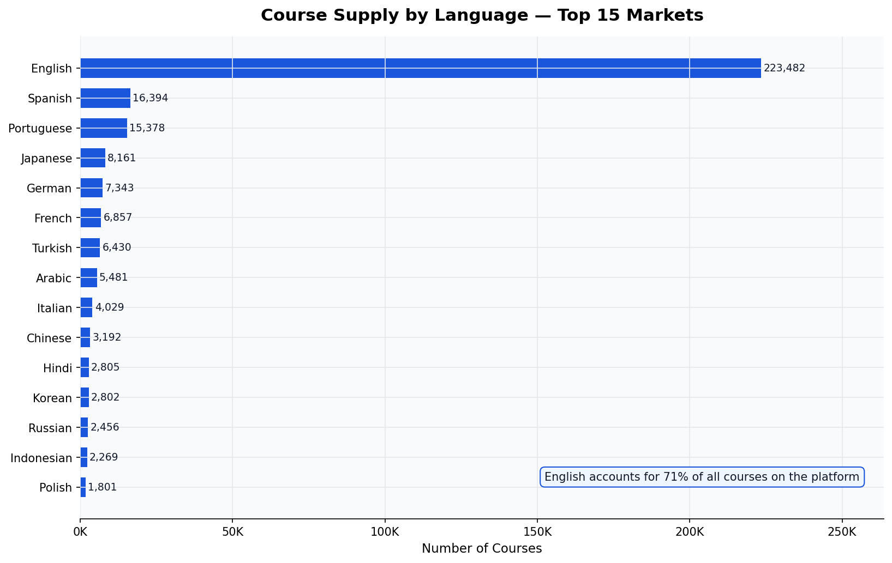

English-language courses account for **69% of the entire platform** — a concentration that reveals a structural imbalance. Languages such as Portuguese (Brazil), Japanese, German, and Turkish each represent thousands of courses, but remain a fraction of the English supply.

**What this means:** Creators and publishers targeting non-English speaking audiences face far less competition than those entering the English market. A high-quality Spanish, Hindi, or Indonesian course competes against a much smaller pool than an equivalent English course, while serving populations in the hundreds of millions.

---

## 2. Is the Market Growing or Maturing?

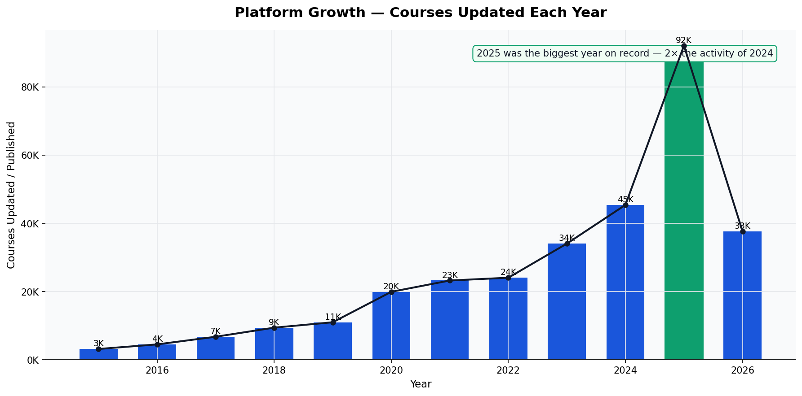

Course creation and updates have accelerated sharply. **2025 was the single largest year on record** — with over 92,000 courses updated or published, more than double the 45,000 in 2024. Even the first two months of 2026 already account for 37,000 courses.

**What this means:** This is not a mature, saturating market. It is in active expansion. New entrants are still arriving in large numbers, and existing creators are actively refreshing their content. The window for establishing a foothold remains open — but the pace of competition is intensifying.

---

## 3. Who Are Courses Built For?

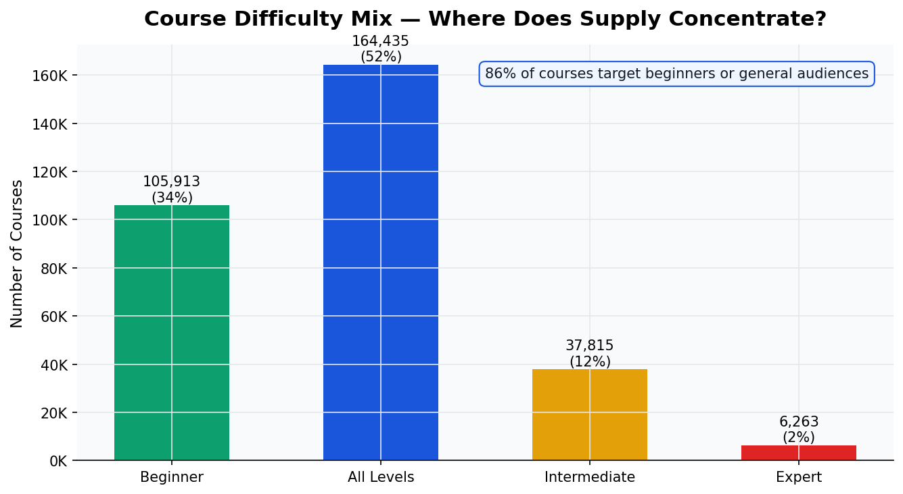

**86% of all courses** are aimed at beginners or general ("all levels") audiences. Only 12% target intermediate learners, and just 2% are designed for experts.

**What this means:** The beginner segment is the most crowded and most competitive. The intermediate-to-expert range is a relative white space — learners who have already completed one or two beginner courses and are looking to go deeper have far fewer options to choose from. Publishers looking to differentiate should consider whether the underserved intermediate and expert segments represent a higher-value opportunity.

---

## 4. What Does "Good" Look Like? The Quality Benchmark

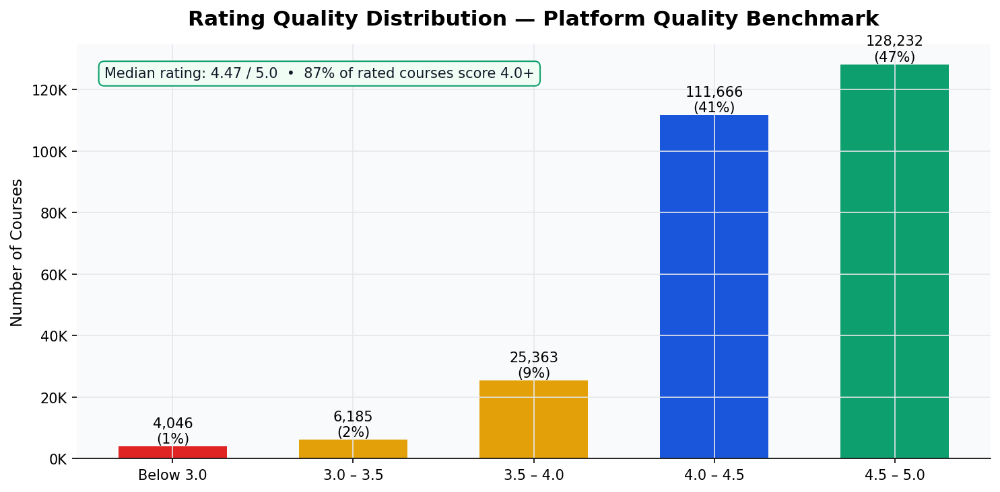

The platform's median rating is **4.47 out of 5.0**, and 87% of rated courses score 4.0 or above. The distribution is heavily concentrated in the 4.0–5.0 band — a below-average course scores around 3.5, not 2.5.

**What this means:** The quality bar on this platform is already high. A course rated 3.8 is effectively in the bottom tier despite appearing to score well on an absolute scale. Any new course entering the market must credibly reach the 4.3+ range to be considered competitive. Quality is not a differentiator — it is the entry requirement.

---

## 5. The Winner-Takes-Most Dynamic

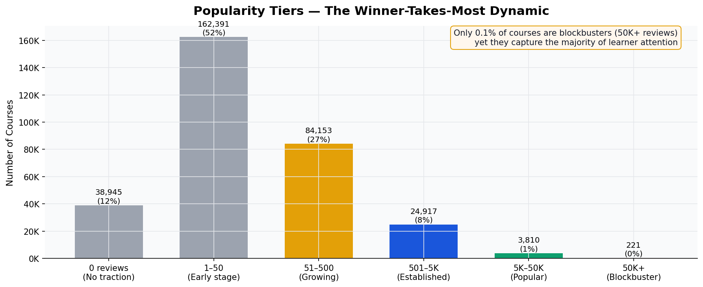

The platform's attention is deeply concentrated. **57% of courses have between 0 and 50 reviews** and have essentially no measurable traction. At the other end, fewer than 1% of courses are blockbusters (50,000+ reviews) yet they represent the overwhelming majority of learner enrollment and platform revenue.

**What this means:** Discovery on this platform follows a power law — the top courses compound their lead while the long tail stagnates. A new course needs a deliberate launch strategy (external marketing, promotions, early review campaigns) to escape the "no traction" tier. Simply publishing and waiting is not a viable growth path.

---

## 6. Monetization Strategy by Audience Segment

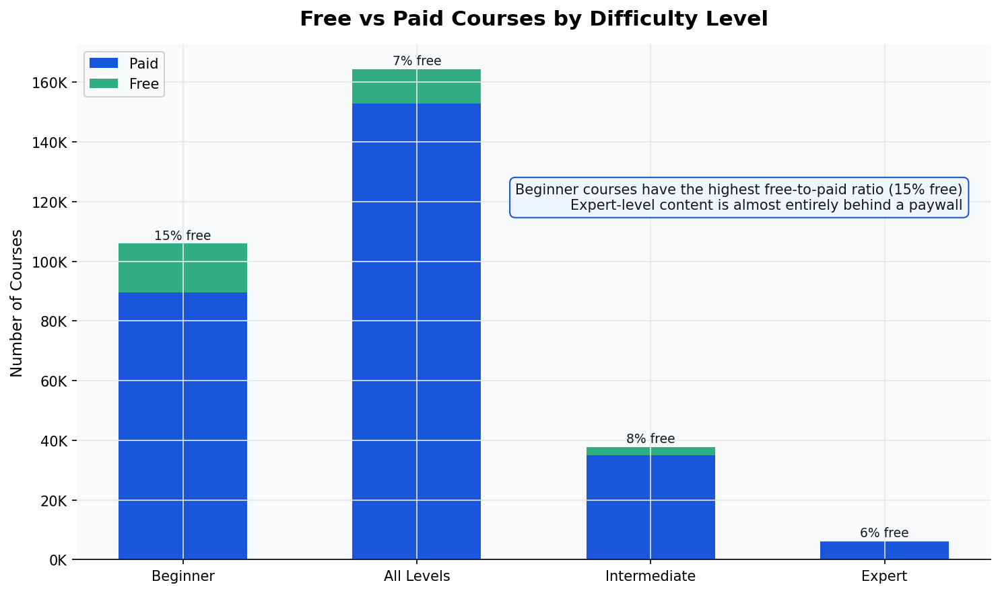

The platform is overwhelmingly paid (90% of all courses). However, the free/paid balance varies meaningfully by audience segment. **Beginner courses have the highest free ratio at ~15%**, while expert courses are almost entirely paid. This reflects both a market access strategy (free content to attract new learners) and a value perception signal (advanced knowledge commands a price).

**What this means:** Free courses serve as top-of-funnel tools, particularly at the beginner level. A publisher entering the beginner segment should expect to compete against free alternatives. The expert segment, by contrast, has less free competition and learners who are more accustomed to paying for specialized knowledge.

---

## 7. The Instructor Landscape — Concentrated at the Top

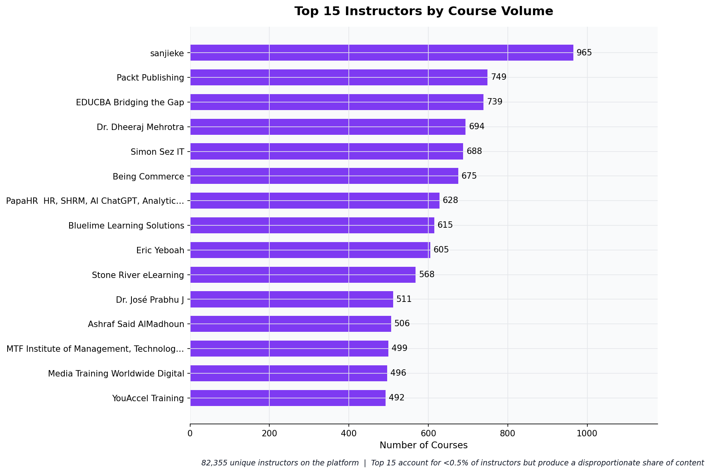

There are **82,355 unique instructors** on the platform. The top 15 each publish hundreds of courses — these are primarily training companies and content studios, not individual subject-matter experts. The most prolific single entity has nearly 1,000 courses.

**What this means:** The high-volume instructors are not individuals — they are production operations. For individual experts, the competitive advantage lies not in volume but in depth, specialization, and personal brand. For organizations, this data reveals that systematic content factories already occupy the volume end of the market.

---

## 8. What Content Format Works?

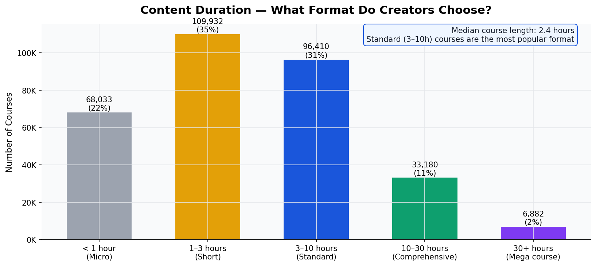

The most common course format is **3–10 hours ("Standard")**, representing the largest share of the catalog. Short courses (1–3 hours) are the second most popular format. Comprehensive courses (10–30 hours) and micro-content (under 1 hour) each occupy smaller but meaningful niches.

**What this means:** The market has settled on a "standard course" format of 3–10 hours as the primary offering. This likely reflects the balance between perceived value (long enough to justify payment) and completion rates (short enough to finish). Publishers designing new courses should treat 3–10 hours as the baseline expectation, with deviations requiring clear justification.

---

## 9. Quality Signals Are Scarce — and Powerful

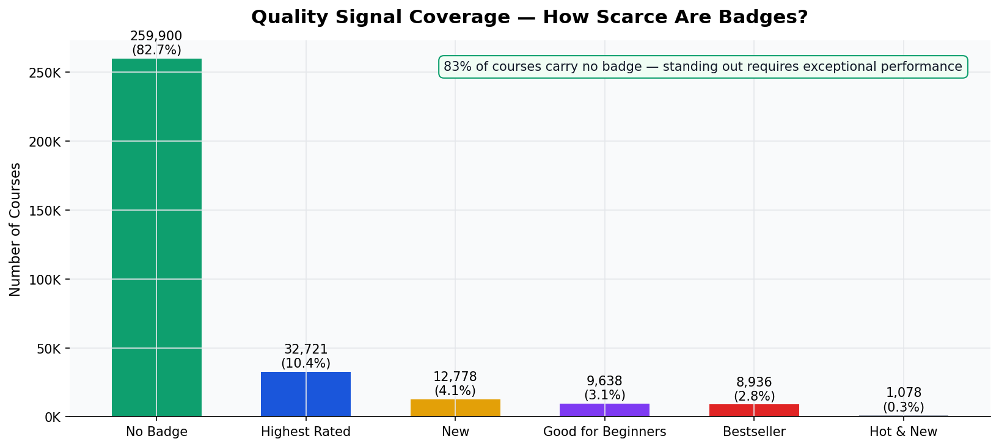

Only **17% of courses carry any quality badge**. The most common badge is "Highest Rated," followed by "Good for Beginners," "Bestseller," and "New." A course with no badge is in the majority — but also invisible from a trust-signal perspective.

**What this means:** Badges serve as powerful social proof in a market where learners cannot easily evaluate quality before purchase. A single "Bestseller" or "Highest Rated" badge distinguishes a course from 83% of the catalog. Achieving a badge — whether by volume of sales (Bestseller) or quality of ratings (Highest Rated) — should be treated as a strategic milestone, not a vanity metric.

---

## 10. Quality by Market — Are Some Languages Higher-Rated?

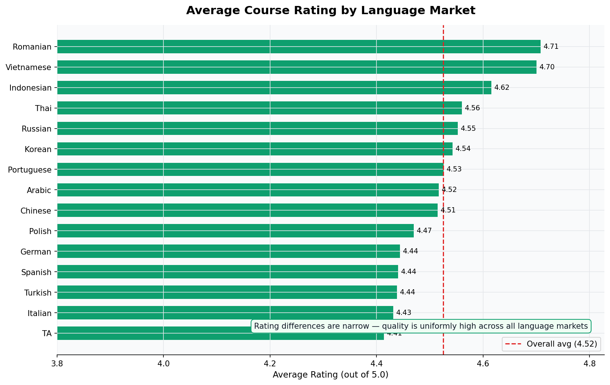

Average ratings are remarkably consistent across language markets, all clustering between 4.2 and 4.5. There is no major language market with systematically low-quality content.

**What this means:** Learners in every language market have the same high expectations. The assumption that non-English markets are more forgiving of lower quality is not supported by the data. A course published in Arabic, Hindi, or Vietnamese will be judged by the same 4.3+ standard as its English equivalent.

---

## 11. Monetization Rates Across Language Markets

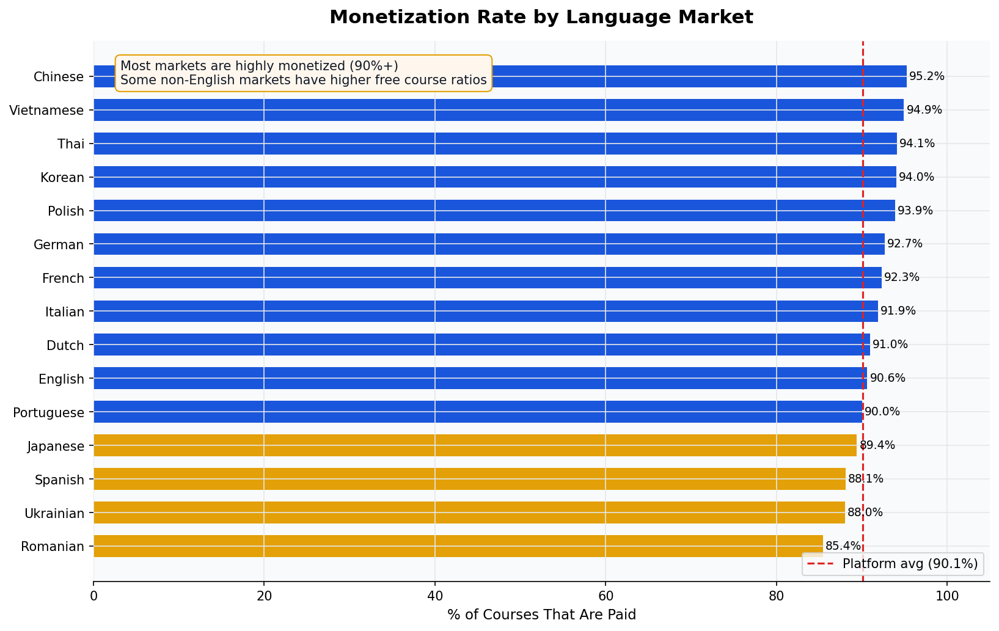

Paid courses dominate across all language markets, with most above 90%. Some non-English markets show slightly higher free course ratios, suggesting either different audience expectations or different creator strategies in those markets.

**What this means:** Monetization is not an English-market-only phenomenon. Creators in Portuguese, Turkish, Japanese, and Arabic markets are successfully selling courses. The revenue opportunity in non-English markets is real and validated, not theoretical.

---

## 12. Content Freshness — Is the Catalog Current?

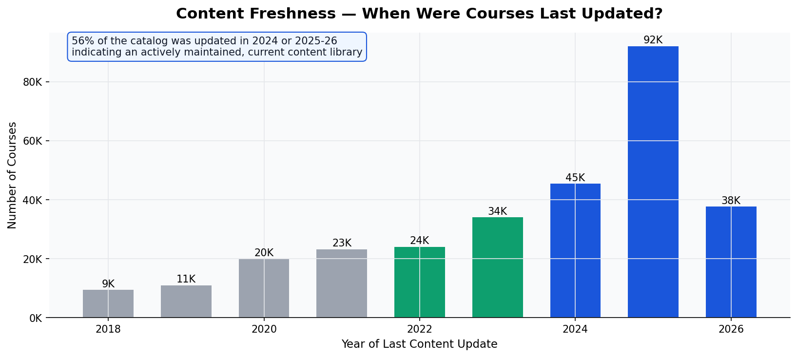

**57% of the catalog was updated in 2024, 2025, or early 2026.** Content from 2018 or earlier represents a small fraction. This is a living, actively maintained library.

**What this means:** Learners searching for current skills will find up-to-date content. For creators, this also means that older, unmaintained courses are increasingly at a disadvantage — last-updated dates are visible to learners and factor into search rankings. Regular content refreshes are not optional for staying competitive.

---

## Strategic Recommendations

Based on the full analysis, five actions stand out as highest-impact:

**1. Target non-English markets first.**
Competition is structurally lower in Portuguese, Japanese, Turkish, Arabic, and other non-English markets. Quality expectations are identical, but the number of competitors is 10–50× smaller.

**2. Aim above beginner level.**
The beginner segment is the most saturated and has the most free competition. Intermediate and expert courses face far fewer rivals and attract learners with demonstrated commitment.

**3. Invest heavily in the launch phase.**
57% of courses never gain traction. The difference between a course with 20 reviews and one with 2,000 is almost never quality — it is the launch strategy. External promotion, early reviews, and initial visibility campaigns are non-negotiable.

**4. Treat 4.3+ as the minimum, not the goal.**
With 87% of rated courses scoring 4.0 or above, the competitive floor is high. Design and production standards must deliver 4.5+ ratings to be visible and credible.

**5. Pursue a quality badge as a strategic milestone.**
Only 17% of courses have a badge. Achieving "Highest Rated" or "Bestseller" status dramatically increases discoverability and conversion. Structure pricing, promotion, and review strategy around earning a first badge within 90 days of launch.

---

- *Analysis based on 314,437 courses scraped from the Udemy platform in February 2026.
- *Dataset available on Kaggle: [https://www.kaggle.com/datasets/ismetsemedov/udemy-courses](https://www.kaggle.com/datasets/ismetsemedov/udemy-courses)*
